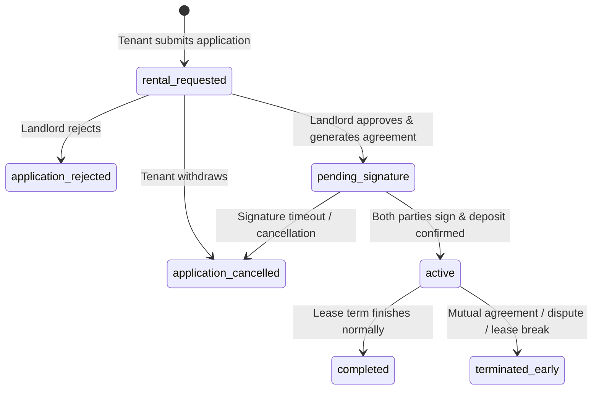
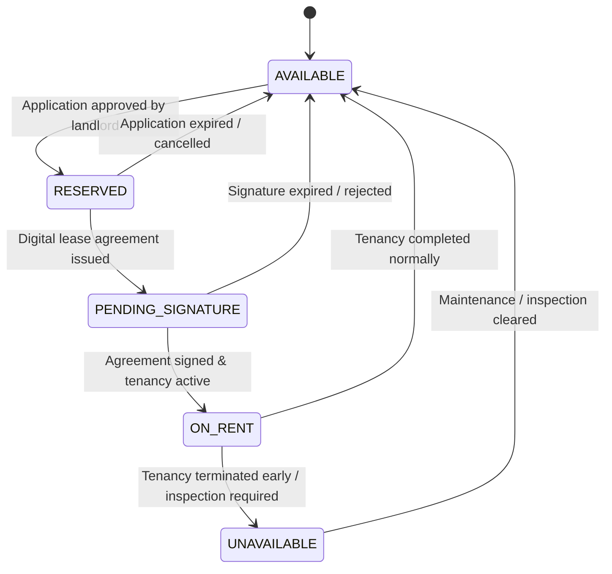

# RentHub Final Architecture Specification

## 1. System Overview & Core Tenets

RentHub is a unified, end-to-end digital tenancy lifecycle management platform. It spans physical property modeling, geospatial search, lease agreement execution, digital rent records, utility metering, maintenance triage, dual dispute resolution, and review governance.

### Architectural Tiers
- **Web Client**: React + TypeScript + Vite (Responsive Web App for Tenants, Landlords, Admins)
- **Mobile Client**: Flutter (Cross-platform iOS/Android first-class client)
- **Backend API**: Node.js + Express + TypeScript (Modular Domain Monolith)
- **Primary Database**: PostgreSQL 16 with PostGIS 3.4 spatial extension (Spatial Indexes, Relational Integrity, Partial Unique Indexes, ACID Transactions)
- **Cache & Ephemeral Store**: Redis 7 (Session revocation, rate limiting, temporary FSM chatbot states)

---

## 2. High-Level Backend Domain Modules

The backend is structured into clear domain boundaries to eliminate spaghetti dependencies:

1. **Authentication (`auth`)**: Google-only OAuth verification, JWT access tokens (short-lived), refresh tokens (rotated), token revocation list.
2. **Users & Profiles (`users`)**: User profiles, dual-role management (acting as Tenant and Landlord within one account), Admin role flag, contact details.
3. **Properties (`properties`)**: Physical building representation, address metadata, cover and gallery photos, physical building amenities.
4. **Property Units / Floors (`properties/units`)**: Rentable unit representation, floor number, unit identifier, pricing, unit-specific specs.
5. **Amenities (`properties/amenities`)**: Normalized lookup catalog of amenities (categorized by building vs. unit level).
6. **Images & Media (`common/media`)**: Multi-part upload handling, metadata tracking, secure URL resolution, image optimization.
7. **Verification & Badges (`properties/verification`)**: Landlord and property verification pipeline, normalized verification badges (e.g., Ownership Verified, Physical Inspection Passed).
8. **Availability Engine (`properties/availability`)**: Authoritative state synchronization between unit availability and tenancy states.
9. **Spatial Search Engine (`search`)**: PostGIS geospatial point indexing (`GEOGRAPHY(Point, 4326)`), `ST_DWithin` spatial calculations, authoritative exponential radius expansion.
10. **Rental Requests (`tenancy/requests`)**: Tenant rental applications, landlord application approval/rejection pipeline, pre-tenancy verification.
11. **Tenancies (`tenancy/core`)**: Contractual binding lifecycle, strict one-active-tenancy database constraint enforcement, lease dates, rent lock.
12. **Agreements (`tenancy/agreements`)**: Digital rental agreement document generation, PDF synthesis, legal clause management, digital signing metadata.
13. **Payments & Payment Records (`finance/payments`)**: Rent dues schedule, payment logging (cash/bank transfer/receipt upload), payment audit logs, PDF receipts.
14. **Utilities (`finance/utilities`)**: Meter registry (water, electricity, gas), periodic meter readings, consumption billing records.
15. **Maintenance (`maintenance`)**: Problem report lifecycle, multi-photo defect attachment, severity ratings, landlord status updates, resolution logging.
16. **Listing Disputes (`disputes/listing`)**: Independent reporting flow for fraudulent listings, inaccurate locations, and scam prevention.
17. **Tenancy Disputes (`disputes/tenancy`)**: Formal contractual disputes between active/past landlords and tenants (deposit withholding, illegal eviction, lease breaches).
18. **Reviews & Exit Surveys (`reviews`)**: Tenancy-gated property reviews (1–5 stars for completed tenancies) vs. structured early termination exit surveys.
19. **Documents & Vault (`vault`)**: Encrypted/restricted storage for sensitive assets (lease contracts, government IDs, dispute evidence), strictly gated by role and tenancy association.
20. **Notifications (`communication/notifications`)**: In-app and real-time push/WebSocket notifications for lifecycle events.
21. **Chatbot / Leads (`communication/chatbot`)**: Deterministic Finite State Machine (FSM) for BANT (Budget, Authority, Need, Timeline) rental lead qualification. No LLM dependency.
22. **Admin & Moderation (`admin`)**: Landlord badge validation, listing dispute adjudication, platform-wide analytics, account suspension.
23. **Audit Logs (`common/audit`)**: Immutable chronological activity ledger for critical financial, dispute, and tenancy transitions.

---

## 3. Structural Hierarchy & Domain Modeling

### 3.1 Property → Floor/Unit → Tenancy Hierarchy
```
Property (Building/Physical Asset)
  ├── Lat / Lng Location: GEOGRAPHY(Point, 4326)
  ├── Street Address, City, Postal Code
  ├── Landlord Owner ID
  ├── Physical Building Attributes & Badges
  │
  └── PropertyUnit / FloorUnit (Rentable Entity)
        ├── Floor Number / Unit Identifier
        ├── Base Rent, Deposit Amount
        ├── Bedrooms, Bathrooms, Area SqFt
        ├── Availability State (AVAILABLE, RESERVED, PENDING_SIGNATURE, ON_RENT, UNAVAILABLE)
        │
        └── Tenancy (Contractual Lease Binding)
              ├── Tenant User ID
              ├── Start Date, End Date
              ├── Agreed Monthly Rent & Deposit
              ├── Tenancy Status (pending_signature, active, completed, terminated_early)
              ├── Rental Agreement (PDF & Signatures)
              ├── Rent Payments & Utility Readings
              └── Maintenance & Tenancy Disputes
```
*Rules*:
- Landlord can own and manage multiple `Properties`.
- Each `Property` contains one or more `PropertyUnits`.
- A lease/tenancy is strictly attached to a specific `PropertyUnit`, never to the entire building directly.
- Individual rooms within a unit are not modeled as standalone rentable entities.

---

## 4. Lifecycles & State Transitions

### 4.1 Tenancy Lifecycle


### 4.2 PropertyUnit Availability Lifecycle


*Search Visibility Rule*:
- Only units in `AVAILABLE` state are returned in public map and search queries.
- `RESERVED`, `PENDING_SIGNATURE`, `ON_RENT`, and `UNAVAILABLE` units are excluded from public search.

---

## 5. Enforcement of the "One Active Tenancy" Rule

### 5.1 Database Partial Unique Index
To protect data integrity against race conditions and concurrent requests, PostgreSQL enforces uniqueness on active tenancies:
```sql
CREATE UNIQUE INDEX idx_one_active_tenancy_per_tenant 
ON tenancies (tenant_id) 
WHERE status IN ('active', 'pending_signature');
```

### 5.2 Rationale for Including `pending_signature`
If a tenant could enter `pending_signature` across multiple properties simultaneously, they could hold several units off the market (in `RESERVED` or `PENDING_SIGNATURE` status), disrupting multiple landlords. Inclusion ensures:
1. A tenant cannot commit to signing a lease when they already hold an active tenancy.
2. A tenant cannot lock multiple units simultaneously across different landlords.
3. Historical records (`completed`, `terminated_early`) are unaffected by the partial index.

### 5.3 Concurrency Control during Application Approval
When a landlord clicks "Approve Application":
1. Open database transaction (`SERIALIZABLE` or with row-level locks).
2. `SELECT id FROM tenancies WHERE tenant_id = $1 AND status IN ('active', 'pending_signature') FOR UPDATE;`
3. `SELECT availability_status FROM property_units WHERE id = $2 FOR UPDATE;`
4. If either condition fails (tenant already has an active/pending lease, or unit is not `AVAILABLE`), rollback with a clear validation error.
5. Otherwise, insert tenancy in `pending_signature` and transition unit to `PENDING_SIGNATURE`.

---

## 6. PostGIS Geospatial & Exponential Radius Search

### 6.1 Database Model
- Column: `properties.location` typed as `GEOGRAPHY(Point, 4326)`.
- Index: Spatial GiST index (`CREATE INDEX idx_properties_location_gist ON properties USING GIST (location);`).

### 6.2 Authoritative Radius Expansion
- Radius progression steps (in km): `[1, 2, 4, 8, 16, 32]`.
- Configurable settings in backend configuration:
  - `INITIAL_RADIUS_KM = 1`
  - `MAX_RADIUS_KM = 32`
  - `MIN_RESULTS_THRESHOLD = 3`
  - `RADIUS_MULTIPLIER = 2`
- The backend evaluates the query at the initial radius. If fewer than `MIN_RESULTS_THRESHOLD` results are found, it steps to the next multiplier up to `MAX_RADIUS_KM`.
- The response metadata returns:
  ```json
  {
    "queryRadiusMeters": 4000,
    "stepLevel": 3,
    "maxRadiusReached": false,
    "totalAvailableUnits": 5
  }
  ```
- **Frontend Map Visualization**: The Web and Flutter map interfaces render a visual bounding circle representing `queryRadiusMeters`, guaranteeing 100% visual parity with the backend query boundary.

---

## 7. Dual Dispute System Separation

To prevent cross-domain pollution, two separate database tables and workflows are maintained:

1. **Listing Disputes (`listing_disputes`)**:
   - Focus: Marketplace integrity, anti-fraud, photo mismatch, fake addresses.
   - Actor: Any authenticated user (prospective tenant or visitor).
   - Target: `properties` table.
   - Resolution: Admin de-lists property or clears report.

2. **Tenancy Disputes (`tenancy_disputes`)**:
   - Focus: Contractual violations, security deposit withholding, maintenance failure, unauthorized eviction.
   - Actor: Verified Tenant or Verified Landlord in that specific lease.
   - Target: `tenancies` table.
   - Resolution: Formal dispute log, mediation notes, agreement addendum, or early termination transition.

---

## 8. Reviews & Exit Surveys

1. **Standard Tenancy Review (`tenancy_reviews`)**:
   - Condition: Tenancy `status = 'completed'`.
   - Payload: 1–5 star rating, written review, amenities feedback.
   - Public visibility: Aggregated on property and landlord profiles.
2. **Early Termination Exit Survey (`early_termination_records`)**:
   - Condition: Tenancy `status = 'terminated_early'`.
   - Payload: Primary reason code (e.g., job relocation, landlord breach, uninhabitable condition), detailed narrative, dispute reference link (if applicable).
   - Visibility: Private to tenancy audit trail and Admin oversight.

---

## 9. Deterministic Lead Chatbot (BANT Engine)

- **Architecture**: Finite State Machine (FSM).
- **No LLM dependency**: Highly predictable, sub-millisecond response, zero token costs.
- **States**:
  1. `GREETING`: Introduce RentHub assistant.
  2. `BUDGET`: Present min/max price range selector.
  3. `LOCATION`: Select preferred neighborhood / target radius.
  4. `NEED`: Select unit type (Bedrooms, Bathrooms, Move-in Date).
  5. `TIMELINE`: Select urgency (Immediate, < 30 days, 1-3 months).
  6. `SUMMARY`: Package qualified lead for landlord or direct to matched PostGIS listings.
- **Persistence**: Session state stored in Redis with 24-hour TTL.

---

## 10. Shared Contracts & Cross-Platform Strategy

```
                          Single Source of Truth
                  [docs/api-specs/openapi.yaml]
                                    │
           ┌────────────────────────┴────────────────────────┐
           ▼                                                 ▼
[shared/ (TypeScript)]                             [mobile/lib/core/models]
  - Types & Enums                                    - Dart Models & Enums
  - Zod Validation Schemas                           - (Generated / Typed via specs)
           │                                                 │
     ┌─────┴──────┐                                          │
     ▼            ▼                                          ▼
[server/]      [web/]                                    [mobile/]
(Node.js API) (React Web)                              (Flutter Mobile)
```

1. **TypeScript Clients (Server & Web)**:
   - Share code directly from `shared/` (`enums`, `types`, `schemas`).
2. **Flutter Mobile Client**:
   - Mobile models are derived directly from the OpenAPI 3.1 specification / JSON Schemas.
   - Eliminates invalid imports of TypeScript code into Flutter while maintaining strict contract parity.

---

## 11. ORM / Data Access Layer Decision: Kysely

**Approved Query/Data-Access Layer**: **Kysely**

**Rationale**:
- **TypeScript Type Safety**: End-to-end compile-time type safety with autocomplete for queries, tables, and columns without bulky generated code.
- **Transparent SQL**: Eliminates ORM magic and N+1 query surprises while providing explicit, predictable query generation.
- **First-Class PostgreSQL Support**: Native compatibility with PostgreSQL 16 advanced features.
- **PostGIS SQL Compatibility**: Seamless integration with raw spatial functions (`ST_DWithin`, `ST_Distance`, `ST_MakePoint`, `ST_SetSRID`) without the friction or bypasses required in traditional ORMs like Prisma.
- **Partial Unique Index & Advanced DDL Support**: Direct compatibility with partial unique indexes (`WHERE status IN ('active', 'pending_signature')`), GiST spatial indexes, and domain constraints.
- **Granular Database Control**: Explicit transaction boundaries and row-level locking (`FOR UPDATE`) for atomic tenancy approval and availability synchronization.

