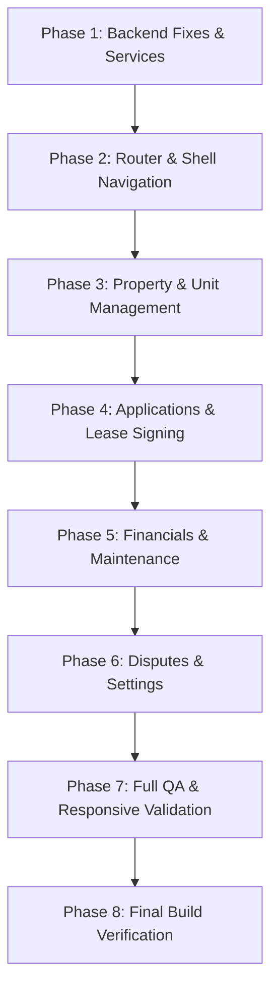

# RentHub — Phase 5: Complete Landlord Portal Implementation Plan

> **Author**: Senior Full-Stack Engineering Team  
> **Status**: Ready for Execution  
> **Authoritative Specification**: [final_architecture_spec.md](file:///c:/Users/Dipesh%20Raj/OneDrive/Desktop/RentHub_Cd/docs/architecture/final_architecture_spec.md)  
> **Brand & Design Guidelines**: [haikei-workflow.md](file:///c:/Users/Dipesh%20Raj/OneDrive/Desktop/RentHub_Cd/docs/ui-ux/haikei-workflow.md)

---

## 1. Executive Summary & Objective

The objective is to complete the entire end-to-end **Landlord Experience** of RentHub. This is not simply a cosmetic UI update: it fixes existing landlord-related bugs, connects directly to the production backend API, eliminates mock data, preserves authoritative database lifecycles, and provides property owners in Nepal with a complete, production-grade management portal.

---

## 2. Core Non-Negotiable Architecture Rules

1. **Authoritative Property Hierarchy**:
   ```
   Property (Physical Building Asset)
       ↓
   PropertyUnit (Rentable Floor / Unit)
       ↓
   Tenancy (Contractual Lease Binding)
   ```
2. **PropertyUnit Availability Lifecycle**:
   ```
   AVAILABLE → RESERVED → PENDING_SIGNATURE → ON_RENT → UNAVAILABLE
   ```
3. **Tenancy Lifecycle**:
   ```
   rental_requested → pending_signature → active → completed / terminated_early
   ```
4. **No LocalStorage as a Database (Rule 5)**:
   - Real landlord, tenant, lease, financial, and KYC data must reside in the actual PostgreSQL database.
   - LocalStorage is strictly restricted to harmless UI state (e.g. sidebar collapse preference).
5. **Dual-Role Switching (Rule 9)**:
   - Users with both `tenant` and `landlord` roles can toggle seamlessly between `Tenant View` and `Landlord View` without logging out and without changing their database roles.

---

## 3. Comprehensive Gap Analysis

| Area | Existing Status | Frontend Status | Backend Status | Database Schema | Action Required |
| :--- | :--- | :--- | :--- | :--- | :--- |
| **Authentication** | Implemented | Working ([AuthContext.tsx](file:///c:/Users/Dipesh%20Raj/OneDrive/Desktop/RentHub_Cd/web/src/features/auth/AuthContext.tsx)) | `/api/auth/google`, `/refresh`, `/logout` | `users` table | Reuse existing session tokens |
| **Role Selection** | Implemented | Working ([RoleSelectionPage.tsx](file:///c:/Users/Dipesh%20Raj/OneDrive/Desktop/RentHub_Cd/web/src/pages/RoleSelectionPage.tsx)) | `POST /api/users/me/roles` | `users.roles` `TEXT[]` | None; preserve onboarding flow |
| **Dual-Role Switch** | **Broken** | Trapped in Landlord view on reload | Supported | `roles` contains both | **Fix router & bi-directional toggle** |
| **Landlord Profile** | Partially implemented | Hardcoded mock data | `GET /api/landlords/me`, `PATCH` | `users` table | Connect to `/api/landlords/me` |
| **Properties** | Partially implemented | Mock only (`INITIAL_PROPERTIES`) | `GET /api/properties/mine` *(missing photos)* | `properties` table | **Fix backend photos query + build real UI** |
| **Property Units** | Missing in UI | Missing in UI | `POST /api/properties/:id/units`, CRUD | `property_units` table | **Build unit manager & floor planner** |
| **Applications** | Broken in UI | Mock only (`INITIAL_APPLICATIONS`) | `GET /api/tenancy/requests` | `rental_requests` table | **Connect to real queue + applicant drawer** |
| **Application Approval**| Broken in UI | Local state mutation only | `POST /api/tenancy/requests/:id/approve` | Atomic lock & unit `RESERVED` | **Wire up real ACID approval call** |
| **Application Rejection**| Broken in UI | Local state mutation only | `POST /api/tenancy/requests/:id/reject` | Status `rejected` | **Wire up real rejection modal** |
| **Tenancies Hub** | Missing in UI | Missing in UI | `GET /api/tenancy/leases`, `/leases/:id` | `tenancies` table | **Build active tenancies view** |
| **Digital Lease Signing**| Missing in UI | Missing in UI | `POST /api/tenancy/leases/:id/sign` | Second signature activates lease | **Build Muluki Civil Code 2074 signer** |
| **Early Termination** | Missing in UI | Missing in UI | `POST /api/tenancy/leases/:id/terminate` | `early_termination_records` table | **Build termination review dialog** |
| **Financial Ledger** | Partially implemented | Mock drawer | Calculated from active tenancies | `tenancies.agreed_monthly_rent` | **Compute live rent roll & deposit escrow** |
| **Payment Gateways** | Missing | Mock cards | Not integrated in backend | No `payments` table | **Display gateway integration status (Rule 21)** |
| **Maintenance Hub** | Missing in UI | Mock `2 Open` | Placeholder module in server | No DB table | **Build triage hub matching tenant categories** |
| **Disputes (§ 398)** | Missing in UI | Missing in UI | `GET /api/tenancy/disputes`, `POST` | `tenancy_disputes` table | **Build legal dispute arbitration center** |
| **KYC Verifications** | Missing in UI | Missing in UI | Tables exist; no dedicated UI | `verifications`, `badges` | **Build Lalpurja/Citizenship status view** |
| **Map Coordinates** | Partially implemented | Missing pin selector | `GEOGRAPHY(Point, 4326)` | PostGIS spatial index | **Add Leaflet Kathmandu pin selector** |

---

## 4. End-to-End Module Specifications

### Module 1: Unified Landlord Shell & Real Command Center
- **Sidebar & Mobile Navigation**:
  - Desktop: Collapsible sidebar with active notification indicators for pending applications and unsigned leases.
  - Mobile/Tablet: Slide-out drawer + sticky bottom navigation.
  - Tabs: `Overview`, `Properties`, `Applications`, `Tenancies / Leases`, `Financials`, `Maintenance`, `Disputes`, `Settings`.
- **Command Center Live Metrics**:
  - Total Properties count (`/api/properties/mine`).
  - Total Rentable Units & Occupancy Rate (% occupied units vs total units).
  - Monthly Expected Gross Income (sum of active leases).
  - Pending Applications count awaiting review.
  - Active Work Orders & Urgent Maintenance.

### Module 2: Seamless Dual-Role Switching (Rule 9)
- **Problem Fixed**: Dual-role users were trapped in Landlord view because `/dashboard` defaulted to `LandlordDashboard` and page reload occurred.
- **Solution**:
  - `DashboardPage.tsx` manages active view mode via URL query parameter (`/dashboard?view=landlord` vs `/dashboard?view=tenant`) and synchronized session state.
  - Bi-directional quick-switch pill in both Tenant and Landlord headers.
  - Zero disruption to database `users.roles`.

### Module 3: Property Portfolio & Unit Management (CRUD + Map Picker)
- **Inventory Listing**:
  - Filter by occupancy: `All`, `Fully Occupied`, `Partially Vacant`, `Vacant`, `Under Maintenance`.
  - Property card with verified ownership badge, unit occupancy progress bar, and cover photo.
- **Add Property Wizard**:
  - *Step 1: General Specs*: Title, description, address, city (Kathmandu, Lalitpur, Bhaktapur), postal code, total floors.
  - *Step 2: PostGIS Coordinates*: Interactive Leaflet pin selector updating `latitude` and `longitude` (`GEOGRAPHY(Point, 4326)`).
  - *Step 3: Unit Configuration*: Add multiple rentable units with unit identifier (`Unit 201`), floor number, BHK configuration, monthly rent (NPR), and security deposit.
  - *Step 4: Amenities & Media*: Building amenities (Solar backup, deep boring water, parking, CCTV, elevator) and photo URLs.
- **Unit Management Drawer**:
  - Modify unit rental pricing, security deposit, and availability status.
  - View associated active tenant and lease link.

### Module 4: Tenant Application Screening & 1-Click Lease Generation
- **Application Queue**:
  - Live list from `GET /api/tenancy/requests`.
  - Filter by property and status (`pending`, `approved`, `rejected`).
- **Applicant Dossier Drawer**:
  - Tenant name, verified email, phone, avatar.
  - Proposed move-in date and application message.
  - Requested unit details (rent, deposit, BHK).
- **Approval Workflow**:
  - Invokes `POST /api/tenancy/requests/:id/approve`.
  - Backend executes ACID transaction: verifies unit is `AVAILABLE`, locks unit to `PENDING_SIGNATURE`, transitions application to `approved`, and creates draft tenancy.
- **Rejection Workflow**:
  - Invokes `POST /api/tenancy/requests/:id/reject` with standard reason options.

### Module 5: Tenancies & Digital Lease Signing (Muluki Civil Code 2074)
- **Lease Portfolio Hub**:
  - Filter by status: `Pending Signature`, `Active`, `Completed`, `Terminated Early`.
  - Real dates, agreed rent, deposit held in escrow, signing status of both parties.
- **Digital Lease Signing Modal**:
  - Full statutory lease agreement text under Nepal's **Muluki Civil Code 2074 (§§ 379–403)**.
  - Bilingual legal clauses: monthly rent due date, maintenance obligations, 35-day eviction/termination notice rule (§ 390).
  - Landlord signature canvas / signature timestamp recording.
  - Calls `POST /api/tenancy/leases/:id/sign`. When both parties have signed, backend automatically activates lease (`active`) and sets unit to `ON_RENT`.
  - Printable / downloadable lease agreement view.
- **Early Termination Review**:
  - Review tenant termination requests, inspect reason code and narrative, execute mutual agreement via `POST /api/tenancy/leases/:id/terminate`.

### Module 6: Financial Operations & Rent Ledger
- **Financial Analytics**:
  - Expected Gross Rent vs Collected Rent vs Overdue.
  - Security Deposit Escrow tracking.
- **Rent Roll Ledger**:
  - Detailed table of rent obligations across all properties and units.
- **Manual Payment Logger**:
  - Record direct cash or bank transfer payments (Nabil, NIC Asia, Global IME, eSewa), updating rent records and generating printable receipts.
- **Gateway Configuration Status (Rule 21)**:
  - Transparent integration status for eSewa Merchant, Khalti, and ConnectIPS without fake transactions.

### Module 7: Maintenance Hub & Contractor Assignment
- **Work Order Kanban / List**:
  - Categories: `Plumbing`, `Electrical`, `HVAC`, `Appliances`, `Carpentry`, `Structural`.
  - Urgency flags: `Emergency`, `High`, `Normal`, `Low`.
  - Status pipeline: `Reported` → `Scheduled` → `In Progress` → `Resolved`.
- **Detail Modal**:
  - View defect photos uploaded by tenants.
  - Assign contractor / technician.
  - Schedule inspection visit window.
  - Update status and add landlord resolution notes.

### Module 8: Dispute Resolution Center (Section 398)
- **Dispute Mediation**:
  - Query and display formal tenancy disputes from `GET /api/tenancy/disputes`.
  - Timeline of claims, evidence documents, and settlement offers under Muluki Civil Code 2074 § 398.

### Module 9: Landlord Profile & Verification Settings
- **Profile Settings**:
  - Update phone number, display name, avatar via `PATCH /api/landlords/me`.
- **Ownership Verification (Lalpurja / Citizenship / PAN)**:
  - Secure document upload guidance and verification status badges (`Not Submitted`, `Pending Review`, `Verified`).
- **Payout Accounts**:
  - Bank account details and mobile wallet identifiers for rent deposits.

---

## 5. Implementation Roadmap (Phases 1–8)



### Phase 1: Backend Fixes & Landlord Service Layer
1. Fix `server/src/modules/properties/properties.service.ts`: Update `getLandlordProperties` to join and return `photos` from the `photos` table.
2. Verify all 297 Vitest tests continue to pass.
3. Create `web/src/features/landlord/landlord.service.ts`: Full TypeScript API client connecting to all real backend endpoints.
4. Define clean interfaces in `web/src/types/landlord.ts`.

### Phase 2: Dual-Role Router & Navigation Shell
1. Update `web/src/pages/DashboardPage.tsx` with query parameter routing (`?view=landlord` / `?view=tenant`).
2. Add bi-directional quick-switch controls in both `TenantDashboard.tsx` and `LandlordDashboard.tsx`.
3. Create `web/src/features/landlord/components/LandlordSidebar.tsx` and header.

### Phase 3: Property & Unit Management
1. Create `web/src/features/landlord/components/PropertiesListView.tsx` with occupancy filters.
2. Build `AddPropertyModal.tsx` with multi-step wizard and Leaflet Kathmandu coordinates pin picker.
3. Build `EditPropertyModal.tsx` and Unit Management drawer.

### Phase 4: Application Screening & Digital Leases
1. Create `ApplicationReviewView.tsx` connected to `GET /api/tenancy/requests`.
2. Connect real Approve and Reject actions (`POST /api/tenancy/requests/:id/approve` and `reject`).
3. Create `LandlordLeasesView.tsx` and `LandlordLeaseSignModal.tsx` with Muluki Civil Code 2074 bilingual agreement and signature canvas.

### Phase 5: Financials & Maintenance Hub
1. Create `FinancialsLedgerView.tsx` with real rent roll calculations and deposit escrow.
2. Create `RecordPaymentModal.tsx` for cash/bank transfer recording.
3. Create `MaintenanceBoardView.tsx` and `MaintenanceDetailModal.tsx` with contractor dispatching and status transitions.

### Phase 6: Disputes & Landlord Settings
1. Create `LandlordDisputesView.tsx` connected to `GET /api/tenancy/disputes`.
2. Create `LandlordSettingsView.tsx` for profile management, Lalpurja verification status, and payout accounts.

### Phase 7: Responsive QA & Error Handling
1. Test viewports at 375px (mobile), 768px (tablet), and 1440px (desktop).
2. Ensure skeletons, loading states, empty states, and toast notifications are implemented for all API actions.

### Phase 8: Final Build & Regression Validation
1. Run `npm --prefix server test` (15 test files, 297 tests).
2. Run `npm --prefix web run build` (`tsc -b && vite build`).
3. Verify Tenant portal features remain 100% functional without regression.
